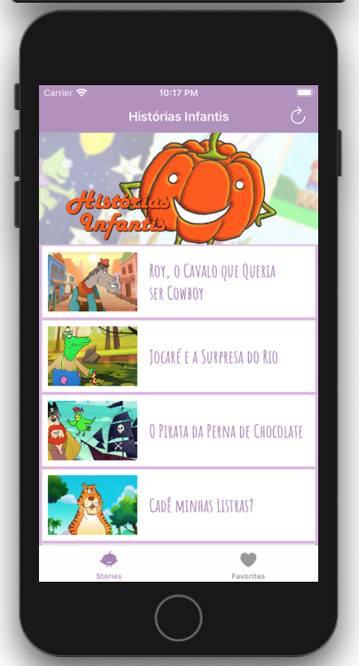
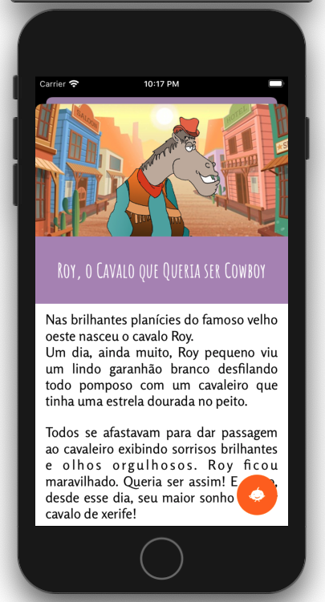
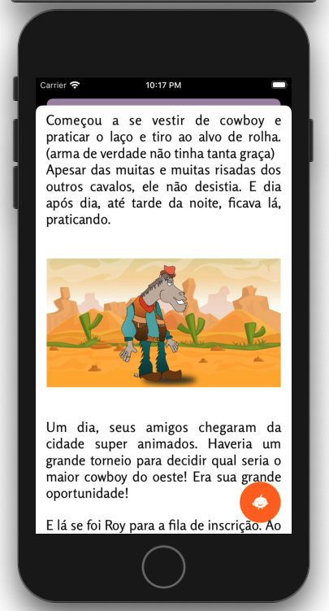
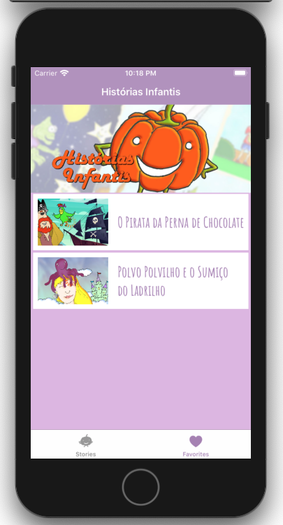

# Histórias Infantis - Capstone Project

The final project of [Udacity's iOS Developer Nanodegree](https://www.udacity.com/course/ios-developer-nanodegree--nd003). 

This project was inspired by a personal Android project that's is currently available at [Google Play Store](https://play.google.com/store/apps/details?id=com.abobrinha.caixinha) that also was base for my Capstone project of [Udacity's Android Nanodegree](https://www.udacity.com/course/android-developer-nanodegree-by-google--nd801) and available in [this repository](https://github.com/oliveira-marcio/HistoriasInfantis).

This app will fetch stories from [Histórias Infantis Blog](https://historiasinfantisabobrinha.wordpress.com/) and display them in an optimized layout for mobile devices with some features that extend blog functionalities:
- Persist stories and images for offline usage.
- Save favorite stories for quick access.

**Screenshots**

<table align="center">
  <tr>
     <td>
       
       
Main screen with all stories

     </td>
     <td>
       
       
Story

     </td>
  </tr>
  <tr>
     <td>
       
       
Story

     </td>
     <td>
       
       
Favorite stories

     </td>
  </tr>
</table>

## Technical Approach

The project was planned with [Clean Architecture](https://blog.cleancoder.com/uncle-bob/2012/08/13/the-clean-architecture.html) and [screaming architecture](https://blog.cleancoder.com/uncle-bob/2011/09/30/Screaming-Architecture.html) in mind and it was greatly inspired in [this article](https://clean-swift.com/clean-swift-ios-architecture/) and its sample code and also in some parts of the codebase I work with at [Talkdesk](https://www.talkdesk.com/cloud-contact-center/wem/mobile-agent/). So you can expect layers as Data, Domain, and Presentation as well as unit tests and component tests to cover the expected use cases and edge cases. 

The API to fetch the stories is provided by the public [WordPress REST API](https://developer.wordpress.org/rest-api/) that returns stories metadata in JSON format where the stories content are coded in HTML, so an extra parsing was required.

Once stories can have an unlimited size and to avoid a great override in mobile devices, I opted to break the stories into separated paragraphs to be loaded in a `UITableView` to get the benefits of recycling.

Besides stories also contains images in their bodies that will be fetched and cached to be displayed in their corresponding positions.

To enable local persistence was used the [Core Data](https://developer.apple.com/documentation/coredata) where stories and favorites are persisted in the database. Images are cached in the file system but their URL references are in the database.

The local persistence is the source of truth for the data being displayed, so all requests to API are firstly synchronized with the persistence before being presented.

Finally, these libraries were used to simplify some of the use cases explained above:

- [Kingfisher](https://github.com/onevcat/Kingfisher) - For downloading and caching images from the web.
- [SwiftSoup](https://github.com/scinfu/SwiftSoup) - For HTML parsing

## Installation

- Clone this repository.
- Run `carthage bootstrap --platform iOS` to download the libraries.
- Import the project into [Xcode](https://developer.apple.com/xcode/) and build it with a simulator.

By default, app uses the real gateway, but if you launch the app with `--mock` command line argument the mock gateway will be used instead.

**Note:**  You can select the corresponding scheme in Xcode (`HistoriasInfantis (Mock)`) as a shortcut to launch the app with mock API.

## Copyright

Project developed by Márcio Souza de Oliveira.
